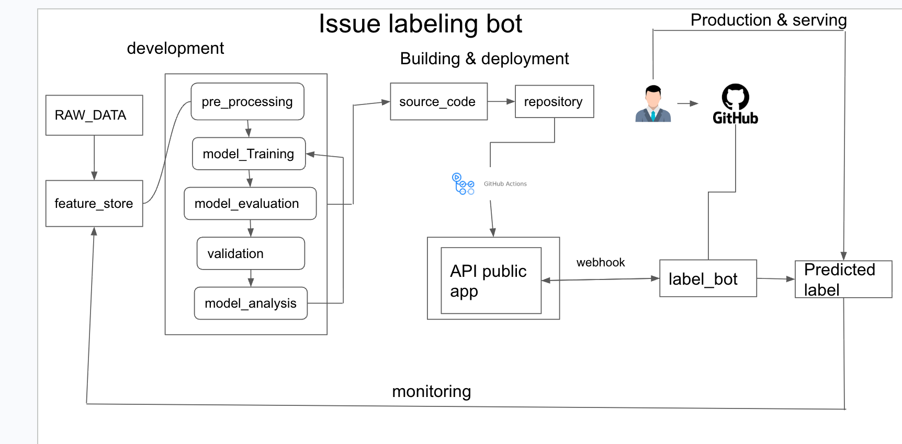

# Issue Labeling Bot 🤖

A GitHub App that automatically labels new issues using machine learning. When an issue is opened in a repository, the bot predicts the most fitting label from the issue's title and body, applies it, and leaves a friendly comment asking for feedback.


## Architecture



The system has three stages:

1. **Development.** Raw issue data is preprocessed and stored in a feature store. A text classification model is trained, evaluated, validated, and analyzed in an iterative loop before the source code is committed.
2. **Building and deployment.** The repository is built and deployed as a public webhook API via GitHub Actions.
3. **Production and serving.** When a user opens an issue, GitHub sends a webhook event to the API. The bot predicts a label, applies it to the issue, and asks the user for feedback. Corrected labels flow back into the feature store for retraining (monitoring loop).

## How it works

```
New issue opened
      │
      ▼ webhook (POST /)
aiohttp server ── verifies signature (GH_SECRET)
      │
      ▼
scikit-learn classifier ── predicts label from title + body
      │
      ▼ GitHub API (gidgethub)
label applied + feedback comment posted
```

## Project structure

```
.
├── app.py                              # Webhook server and event handlers
├── models/
│   └── issue_label_classifier.joblib  # Trained scikit-learn text classifier
├── docs/
│   └── architecture.png               # System architecture diagram
├── Procfile                           # Process definition for PaaS deployment
└── requirements.txt                   # Python dependencies
```

## Setup

### 1. Install dependencies

```bash
python3 -m venv .venv && source .venv/bin/activate
pip install -r requirements.txt
```

### 2. Configure environment variables

| Variable    | Description                                        |
|-------------|----------------------------------------------------|
| `GH_AUTH`   | GitHub personal access token or app installation token |
| `GH_SECRET` | Webhook secret used to verify event signatures     |
| `PORT`      | Port for the web server (set by the platform)      |

### 3. Run locally

```bash
export GH_AUTH=<your-token>
export GH_SECRET=<your-webhook-secret>
python3 -m app
```

Expose the local server with a tool like [ngrok](https://ngrok.com/) and point your GitHub App's webhook URL at it.

### 4. Deploy

The included `Procfile` makes the app deployable to any Procfile-based platform (Heroku, Railway, Render):

```
web: python3 -m app
```

## Tech stack

- **Python 3** with **aiohttp** for the async webhook server
- **gidgethub** for GitHub webhook parsing and API calls
- **scikit-learn** text classification model, serialized with **joblib**

## Feedback loop

The bot comments on every issue it labels. If the prediction is wrong, users can simply correct the label on GitHub. Those corrections are collected and used to retrain the model, so the bot improves over time.
